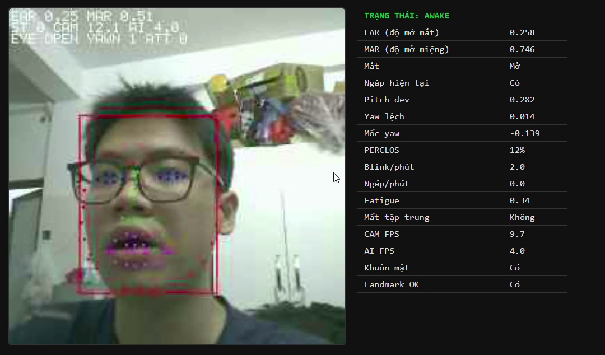
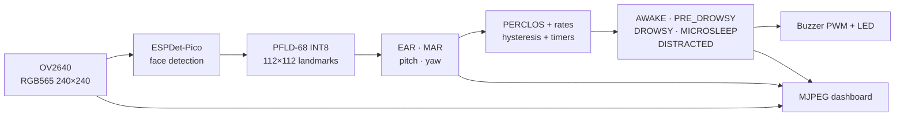

# Hệ thống giám sát buồn ngủ và mất tập trung trên ESP32-S3

> Edge AI chạy trực tiếp trên ESP32-S3-N16R8: nhận diện khuôn mặt, 68 facial landmarks, EAR/MAR/PERCLOS, hướng đầu và cảnh báo buzzer/LED — không cần Raspberry Pi, PC hay cloud để ra quyết định.

[](https://www.espressif.com/en/products/socs/esp32-s3)
[](https://github.com/espressif/esp-idf)
[](https://github.com/espressif/esp-dl)
[](#kiến-trúc-hệ-thống)

## Video thử nghiệm thực tế

[](docs/demo/esp32_laixeantoan.mp4)

**[▶ Xem/tải video thử nghiệm gốc (53,3 giây, 1080×634, H.264)](docs/demo/esp32_laixeantoan.mp4)**

Video cho thấy dashboard thời gian thực tại `192.168.4.1`, khung khuôn mặt, 68 landmarks, EAR, MAR, PERCLOS, trạng thái mắt/ngáp, CAM FPS và AI FPS. File được giữ nguyên để người xem có thể kiểm chứng; SHA-256: `0FD7CBF3D524BF15B2650107BE75E9BB775A2D8CADD7094F09C0DC193E0F7D77`.

## Bài toán và giá trị sản phẩm

Các giải pháp drowsiness detection dùng Raspberry Pi 5 có dư hiệu năng cho bài toán chỉ cần một camera và một người lái, nhưng kéo theo Linux, thẻ nhớ, nguồn công suất lớn hơn, giải pháp tản nhiệt và điều to lớn nhất là chi phí triển khai rất lớn (trên 3.300.000 cho 1 sản phẩm). 
Dự án này sẽ đưa toàn bộ pipeline thị giác xuống một vi điều khiển:

- xử lý tại thiết bị, không gửi hình ảnh khuôn mặt lên cloud;
- hoạt động độc lập, không phụ thuộc Internet hoặc điện thoại;
- khởi động firmware trực tiếp, ít thành phần hơn để triển khai trên xe;
- dùng Wi-Fi tích hợp để xem dashboard, cấu hình và OTA khi cần;
- giảm chi phí phần cứng so với một hệ Raspberry Pi 5 hoàn chỉnh.

Thiết bị theo dõi đồng thời bốn nhóm tín hiệu: mắt nhắm, ngáp, cúi/gật đầu và quay đầu/mất khuôn mặt. Cảnh báo được đưa ra bằng buzzer và LED theo mức độ `AWAKE → PRE_DROWSY → DROWSY → MICROSLEEP`, kèm trạng thái `DISTRACTED` cho mất tập trung.

> [!IMPORTANT]
> Đây là prototype hỗ trợ cảnh báo, chưa phải thiết bị an toàn chức năng hoặc thiết bị y tế. Benchmark hiện tại là thử nghiệm kỹ thuật quy mô nhỏ; không dùng các số liệu dưới đây như chứng nhận an toàn giao thông.

## Kiến trúc hệ thống



Luồng xử lý được chia theo FreeRTOS:

- Core 0 lấy ảnh camera và luôn ưu tiên frame mới nhất.
- Core 1 chạy face detection/PFLD và state machine.
- Alarm chạy non-blocking; web stream có queue riêng nên không giữ lại frame AI cũ.

## Những cải tiến so với giải pháp ban đầu

Dự án kế thừa giải pháp gốc tại [`phuongproduc/Driver-Drowsiness-Detection-ESP32-S3-N16R8-ESP-WHO-ESP-DL-v3-PFLD-`](https://github.com/phuongproduc/Driver-Drowsiness-Detection-ESP32-S3-N16R8-ESP-WHO-ESP-DL-v3-PFLD-) (mốc đối chiếu `9125dfe`, ngày 08/08/2026). Bản gốc đã đặt nền móng cho face detection + PFLD + EAR/MAR/PERCLOS, cảnh báo GPIO, web dashboard và OTA. Phiên bản này bổ sung/điều chỉnh:

| Hạng mục | Giải pháp ban đầu | Cải tiến trong phiên bản này | Lợi ích |
|---|---|---|---|
| Nguồn quyết định | Mặc định offload trạng thái sang điện thoại | `DROWSY_AI_ON_DEVICE=y`; toàn bộ AI chạy trên ESP32-S3 | Độc lập điện thoại/cloud |
| Mất tập trung | Chưa có trạng thái riêng | `DISTRACTED`, yaw lệch so với baseline, face-lost grace và timer | Phân biệt quay đầu với buồn ngủ |
| Bám khuôn mặt | Chạy detector/PFLD theo chu kỳ cố định | Cache face box/landmarks, kiểm tra IoU; detector mỗi 4 frame khi đã khóa mặt | Giảm tải nhưng không dùng nhầm landmark của mặt mới |
| Lịch AI | Queue có thể tích frame cũ | Queue AI 1 phần tử, lấy frame mới nhất; camera và web có nhịp riêng | Giảm độ trễ tích lũy |
| PFLD | Crop theo face box | Crop vuông mở rộng 1,15×, clamp biên, kiểm tra dtype/range | Landmark ổn định hơn khi box không vuông |
| Head pose | Pitch tĩnh | Baseline pitch/yaw tự học và cập nhật chậm khi tài xế tỉnh | Bù vị trí camera và tư thế người dùng |
| Cảnh báo | Phụ thuộc state dài hạn | Tín hiệu mắt/ngáp/mất tập trung có đường cảnh báo tức thời; microsleep tăng dần cường độ | Phản hồi sớm và dễ nhận biết |
| Alarm task | Ghi GPIO ở mọi tick | Chỉ ghi khi output đổi, `xTaskDelayUntil`, kiểm tra lỗi driver, có lệnh test | Ổn định timing và dễ kiểm thử phần cứng |
| Web | FPS/overlay gắn với nhịp AI | Cache overlay có khóa, tách CAM FPS/AI FPS, thêm cờ eye/yawn/attention | Dashboard phản ánh đúng pipeline |
| Hiệu năng S3 | Cấu hình an toàn chung | Octal PSRAM 80 MHz, PSRAM DMA, cache 64 KB, instruction/RODATA ở PSRAM, CPU 240 MHz | Tận dụng đúng N16R8 |
| OTA | Slot khoảng 3,75 MiB | Hai slot 4,5 MiB | Đủ chỗ cho firmware + 2 model nhúng |
| Đo kiểm | Log vận hành thông thường | `BENCH,SAMPLE`, marker console, CSV ground truth, script precision/recall/F1/latency | Benchmark có thể lặp lại |

Các thay đổi chính nằm trong `main/app_main.cpp`, `main/drowsiness_detector.cpp`, `main/landmark_pfld.cpp`, `main/alarm_control.cpp`, `main/web_server.cpp` và `main/benchmark.cpp`.

## Benchmark

### 1. Demo sản phẩm 53,3 giây

Thông số được đọc từ file video gốc và sáu mốc hiển thị tại 0/5/15/30/40/50 giây:

| Chỉ số | Kết quả quan sát |
|---|---:|
| Video | 53,33 s · H.264 · 1080×634 · 30 FPS |
| CAM FPS trên dashboard | 9,7–10,8 FPS |
| AI FPS trên dashboard | 2,9–4,0 FPS |
| Face + landmark | Hiển thị trực tiếp trên dashboard |
| Tín hiệu minh họa | Mắt mở/nhắm, ngáp, EAR, MAR, PERCLOS, pitch/yaw |

Khoảng FPS trên chỉ là các giá trị ở những mốc lấy mẫu của video, không phải trung bình toàn phiên.

### 2. Benchmark gán nhãn thủ công 91,7 giây

Phiên ngày 09/09/2026 gồm 335 mẫu AI, face + landmark hợp lệ ở 99,4% mẫu. Ground truth gồm 2 đoạn mắt nhắm, 5 lần ngáp và 2 đoạn mất tập trung.

| Hành vi | Precision | Recall | F1 | Event recall | Độ trễ p50 / p95 |
|---|---:|---:|---:|---:|---:|
| Mắt nhắm (raw signal) | 68,3% | 63,1% | 65,6% | 2/2 | 627 / 762 ms |
| Ngáp | 100,0% | 72,8% | 84,3% | 5/5 | 649 / 1.012 ms |
| Mất tập trung | 97,4% | 90,5% | 93,8% | 2/2 | 642 / 1.062 ms |

Đây là benchmark trước các bản sửa alarm/false-alert/FPS ngày 12/09/2026. Vì vậy bảng được giữ như baseline trung thực, không dùng để tuyên bố các bản sửa sau đã tăng accuracy nếu chưa chạy lại cùng kịch bản. Xem [báo cáo PDF](benchmark_results/bao_cao_danh_gia_he_thong_buong_ngu.pdf), [ground truth CSV](benchmark_results/2026-09-09_phone_ground_truth.csv) và [cách tái lập](benchmark_results/README.md).

### 3. Footprint firmware/model

| Thành phần | Kích thước đo được |
|---|---:|
| `pfld68.espdl` | 831.808 byte (0,793 MiB) |
| `espdet_pico_224_224_face.espdl` | 495.840 byte (0,473 MiB) |
| Firmware `.bin` | 4.134.080 byte (3,943 MiB) |
| Mỗi OTA slot | 4.718.592 byte (4,5 MiB) |
| Mức sử dụng OTA slot | 87,6% — còn 584.512 byte |

## ESP32-S3 so với Raspberry Pi 5

| Tiêu chí | ESP32-S3-N16R8 của dự án | Raspberry Pi 5 |
|---|---|---|
| Mục tiêu thiết kế | Vi điều khiển edge AI chuyên một tác vụ | Máy tính Linux đa dụng |
| CPU/RAM | 2× Xtensa LX7 240 MHz, 8 MB PSRAM | 4× Cortex-A76 2,4 GHz, RAM từ 1 GB |
| Hệ điều hành | Firmware/FreeRTOS, không cần Linux | Raspberry Pi OS/Linux |
| AI của dự án | ESP-DL + model INT8 nhúng flash | Có thể chạy model lớn hơn, framework Linux |
| Camera/kết nối | DVP camera, Wi-Fi/BLE tích hợp | MIPI camera, Wi-Fi/BLE; cần storage và phụ kiện triển khai |
| Nguồn/tản nhiệt | Phù hợp thiết bị nhúng nhỏ gọn | Nhà sản xuất khuyến nghị nguồn 5 V–5 A và active cooling để đạt hiệu năng tốt |
| Chi phí hệ thống | MCU + camera + buzzer/LED, BOM thấp | Board hiện được Raspberry Pi niêm yết từ 45 USD, chưa gồm camera/storage/nguồn/tản nhiệt |
| Quyền riêng tư | Ảnh được xử lý tại thiết bị | Có thể xử lý local nhưng hệ thống phức tạp hơn |

### Về tuyên bố “độ chính xác như Raspberry Pi 5”

Độ chính xác nhận diện do **model, dữ liệu, preprocessing, lượng tử hóa và threshold**, không do tên board tự quyết định. Khi hai nền tảng chạy cùng model và cùng logic, việc chuyển sang ESP32-S3 chủ yếu đánh đổi throughput/độ trễ; INT8 có thể giữ chất lượng gần mô hình gốc nếu hiệu chuẩn tốt. Trong dự án này, PFLD/metric/state machine được giữ trên thiết bị và benchmark cho thấy ngáp/mất tập trung đạt F1 lần lượt 84,3%/93,8% ở phiên thử ngắn.

Vì chưa có benchmark A/B cùng video trên Raspberry Pi 5, cách diễn đạt kiểm chứng được là:

> **ESP32-S3 duy trì cùng mục tiêu và logic nhận diện của giải pháp Raspberry Pi-class cho bài toán một tài xế, với chi phí và độ phức tạp phần cứng thấp hơn; cần benchmark A/B trên cùng tập dữ liệu trước khi tuyên bố độ chính xác thống kê tương đương.**

Điểm lợi của ESP32-S3 không phải “mạnh hơn Pi 5”, mà là **đủ dùng, rẻ hơn và gọn hơn cho đúng tác vụ**.

## Phần cứng và phần mềm

| Thành phần | Cấu hình |
|---|---|
| MCU | ESP32-S3-N16R8 — 16 MB flash, 8 MB Octal PSRAM |
| Camera | OV2640, RGB565, 240×240 |
| Cảnh báo | Buzzer PWM (mặc định GPIO 14), LED (mặc định GPIO 21) |
| SDK | ESP-IDF 5.3.5 hoặc nhánh 5.3+ |
| AI runtime | `espressif/esp-dl ^3.3.0` |
| Camera driver | `espressif/esp32-camera ^2` |
| Mạng | SoftAP mặc định; STA/OFF tùy chọn |

## Build, flash và chạy

### Cách nhanh nhất trên Windows: một lệnh

Máy chỉ cần có **Git** và **PowerShell**. Script dưới đây tự tải đúng ESP-IDF `v5.3.5`, cài toolchain ESP32-S3, phục hồi các component đúng phiên bản từ `dependencies.lock`, rồi build firmware:

```powershell
git clone https://github.com/manhhung-25/esp32-s3-driver-drowsiness-detection.git
cd esp32-s3-driver-drowsiness-detection
.\scripts\bootstrap.ps1
```

Muốn build, nạp board và mở monitor trong cùng một lệnh (thay `COM7` bằng cổng thực tế):

```powershell
.\scripts\bootstrap.ps1 -Port COM7
```

Lần chạy đầu cần Internet và có thể mất vài phút vì ESP-IDF/toolchain được cài vào `%LOCALAPPDATA%\Espressif`. Các lần sau script tái sử dụng môi trường đã cài. Chỉ muốn build lại nhanh dùng `.\scripts\build.ps1`; muốn flash dùng `.\scripts\flash_monitor.ps1 -Port COM7`.

### Linux/macOS hoặc môi trường đã có ESP-IDF

```bash
git clone https://github.com/manhhung-25/esp32-s3-driver-drowsiness-detection.git
cd esp32-s3-driver-drowsiness-detection

# Nạp môi trường ESP-IDF 5.3+
. $IDF_PATH/export.sh

idf.py set-target esp32s3
idf.py build
idf.py -p /dev/ttyACM0 flash monitor
```

### Dependency và khả năng tái lập

- Firmware C/C++: `main/idf_component.yml` khai báo dependency; `dependencies.lock` khóa đúng phiên bản ESP-DL, camera, JPEG và mDNS. ESP-IDF Component Manager tự tải chúng ở lần build đầu; không cần commit thư mục sinh tự động `managed_components/`.
- Model chạy thật đã nằm sẵn trong `model/`: `espdet_pico_224_224_face.espdl` và `pfld68.espdl`; người clone không cần quantize lại.
- Công cụ Python tùy chọn (kiểm tra ONNX, video, export/quantize model): cài bằng `python -m pip install -r requirements.txt`, hoặc chạy bootstrap với `-WithPythonTools`.
- GitHub Actions trong `.github/workflows/build.yml` tự build lại firmware bằng ESP-IDF `v5.3.5` sau mỗi lần push/PR để phát hiện sớm repo thiếu file hoặc dependency.

Lần nạp đầu phải dùng `flash`, không dùng riêng `app-flash`, vì dự án dùng `otadata` và hai OTA slot.

### Sử dụng nhanh

1. Cấp nguồn cho board và camera.
2. Kết nối Wi-Fi `Drowsy_AP` (mật khẩu mặc định `12345678`).
3. Mở `http://192.168.4.1`.
4. Đặt camera thẳng mặt; giữ mắt mở, nhìn thẳng khoảng vài giây để hệ thống học baseline pitch/yaw.
5. Thử nhắm mắt, ngáp và quay đầu để kiểm tra dashboard/buzzer/LED.

## Console và API

```text
drowsy get
drowsy set ear_blink_th 0.20
drowsy stats
drowsy reset
drowsy bench start
drowsy bench mark eyes_start
drowsy bench stop
drowsy alarm test microsleep
drowsy alarm off
```

| Endpoint | Method | Công dụng |
|---|---|---|
| `/` | GET | Dashboard + MJPEG stream |
| `/capture` | GET | Ảnh JPEG đơn |
| `/status` | GET | Metrics và state JSON |
| `/admin` | GET | Cấu hình thiết bị |
| `/admin/api/config` | GET | Đọc/đổi cấu hình |
| `/admin/api/reboot` | GET | Khởi động lại |
| `/api/alarm` | POST | Gửi state alarm khi chạy chế độ offload |
| `/api/ota` | POST | Nạp firmware OTA |

## Cấu trúc repo

```text
.
├── docs/demo/                  # video và ảnh xem trước
├── benchmark_results/          # ground truth + báo cáo benchmark
├── main/
│   ├── app_main.cpp            # camera/AI/alarm scheduling
│   ├── face_pipeline.cpp       # ESPDet-Pico face detection
│   ├── landmark_pfld.cpp       # PFLD + EAR/MAR/pitch/yaw
│   ├── drowsiness_detector.cpp # fusion + PERCLOS + state machine
│   ├── alarm_control.cpp       # buzzer/LED non-blocking
│   ├── benchmark.cpp           # log BENCH tái lập được
│   └── web_server.cpp          # dashboard, stream, API, OTA
├── model/                      # ONNX và model .espdl nhúng firmware
├── tools/                      # export/quantize/evaluate benchmark
├── scripts/                    # tiện ích build/flash/stream Windows
├── requirements.txt            # dependency Python tùy chọn, cài bằng pip
├── dependencies.lock           # phiên bản component firmware được khóa
├── .github/workflows/build.yml # CI build ESP-IDF 5.3.5
├── partitions.csv              # hai OTA slot 4,5 MiB
└── sdkconfig.defaults*         # cấu hình N16R8/PSRAM/camera
```

## Hạn chế và kế hoạch kiểm chứng tiếp theo

- Benchmark hiện có một người thử, một camera và thời lượng ngắn.
- Kính, ánh sáng yếu, che mặt và góc camera lớn có thể làm EAR/landmark nhiễu.
- Cần chạy lại benchmark sau các fix ngày 12/09, thêm tối thiểu 15–30 phút tỉnh táo để đo false-alarm/hour.
- Cần tập test nhiều người và benchmark A/B cùng video trên Raspberry Pi 5 nếu muốn công bố “accuracy tương đương”.
- Khi dùng trên xe thật cần vỏ, nguồn ổn định, driver transistor cho buzzer lớn và đánh giá EMC/nhiệt/rung.

## Nguồn và ghi công

- **Giải pháp/repo gốc:** [phuongproduc — Driver Drowsiness Detection ESP32-S3](https://github.com/phuongproduc/Driver-Drowsiness-Detection-ESP32-S3-N16R8-ESP-WHO-ESP-DL-v3-PFLD-). Phiên bản này là phần phát triển tiếp theo và giữ liên kết nguồn để truy vết.
- **ESP-DL:** [framework inference và quantization chính thức của Espressif](https://github.com/espressif/esp-dl).
- **ESP-WHO:** [framework computer vision chính thức của Espressif](https://github.com/espressif/esp-who).
- **ESP32-S3:** [datasheet chính thức](https://www.espressif.com/sites/default/files/documentation/esp32-s3_datasheet_en.pdf).
- **PFLD:** Guo et al., [“PFLD: A Practical Facial Landmark Detector”](https://arxiv.org/abs/1902.10859).
- **EAR:** Soukupová & Čech, [“Eye Blink Detection Using Facial Landmarks”](https://cmp.felk.cvut.cz/ftp/articles/cech/Soukupova-TR-2016-05.pdf).
- **PERCLOS:** [NHTSA review of vehicle-based drowsiness sensors](https://static.nhtsa.gov/nhtsa/downloads/p2017-documents/811886-Assess_veh-based_sensors_4_drowsy-driving_detection.pdf).
- **Raspberry Pi 5:** [trang sản phẩm/thông số chính thức](https://www.raspberrypi.com/products/raspberry-pi-5/) và [giá khởi điểm hiện hành](https://www.raspberrypi.com/products/).

## License và dữ liệu

Mã nguồn kế thừa phải tuân theo license của repo gốc và các dependency/model tương ứng. Hãy kiểm tra license của checkpoint/dataset trước khi thương mại hóa. Video demo thuộc người thực hiện dự án và được đưa vào repo làm minh chứng theo yêu cầu của chủ sở hữu.
